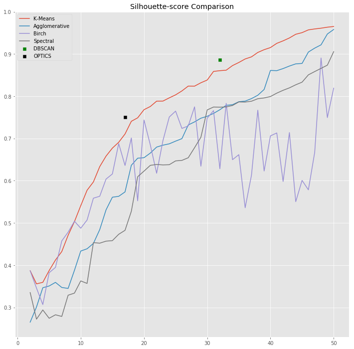

# Face Clustering
Clusterize faces according to facial attributes. FVAB final course project [UL19]. 

> The work presented here, is inspired by the paper: ***"Deep Learning Face Attributes in the Wild "*** by Ziwei Liu et al.

## Project Structure

* **weights/:** contains the weights of the trained model. The pre-trained model is heavily based on the MobileNetV2 architecture, and is able to infer 37 facial attributes with an **accuracy of 90.95%**.
* **notebook/:** contains the Jupiter Notebook version of the code (to be precise are Colab notebooks). Running the code as notebook (either with **Jupyter**, Google **Colab** or **Kaggle** Notebook) is highly suggested. All the work is organized into three sections:
  1. `UL19_Dataset`: Shows how to load and deal with the CelebA dataset. There's a data exploration section which shows how the data is structured and distributed.
  2. `UL19_Training`: Details the model architecture, the training phase (data augmentations, model optimizer, checkpointing), and the testing phase.
  3. `UL19_Clustering`: Puts everything together. You can load your data from multiple sources ([CelebA](http://mmlab.ie.cuhk.edu.hk/projects/CelebA.html) and [LFW](http://vis-www.cs.umass.edu/lfw/) in the provided code), and let the model infer the attributes. After that, the faces (along with their attributes label) can be grouped into clusters. 
* **py/:** Pure Python version of the notebooks, structured has above and generating from them.

---

## **Usage**

1. **Clone** the repository.
2. **(Install libraries):** Only in case you want to test the code (py scripts) on your local machine. The following libraries are required: ***Keras***, ***Tensorflow*** (possibly with GPU compatibly), ***Numpy***, ***Sklearn***, ***Pandas***, ***Matplotlib***, ***OpenCV***, wget (used only to download stuff), and **kaggle**.
3. **Set Kaggle credential:** In order to download the CelebA dataset, you need to generate a `kaggle_key` from you kaggle account, and replace the `YOUR_USERNAME` and `YOUR_API_KEY` placeholders with your credentials.
4. **Edit model path:** Before running the code check the model path! In the code I assume that the model is loaded from Google Drive. So you can: 
   * Change every path (in particular `model_path`) according to the `weights\` folder of the repo. Or,
   * Upload the model on your Google Drive (and edit its location).
   * Basically, the paths to change are `save_path` (used to load/store from Google Drive) and `model_path`.

---

## Results

Here we show some qualitative results, obtained by grouping faces into clusters. The face images are taken from the **CelebA** and **LFW** datasets.

From a given cluster, we **summarize** it by:

* **Attribute-occurrence chart**: for every attribute, it shows how many times it occurs. This is useful to: (1) spot *noisy-attributes*: the ones with low occurrence frequency, and (2) understand the quality of the cluster by analyzing the distribution of the attributes. 
* **Eigenface:** it's able to synthesize the prominent attributes (the ones with the greater frequency) at a visual level. A cluster's eigenface carries two type of information at the same time. It shows what are the principal (more common) attributes within that cluster, and implicitly their occurrence frequency (an eigenface vary according to the frequency of attributes).

In our approach, we first **infer the facial attributes** (in this case only ten are selected), then grouping them by **K-Means clustering**. 

Here we show a comparison of the performance of common clustering techniques taken from [sklean library](https://scikit-learn.org/stable/modules/clustering.html). The chart shows the **silhouette score** versus the **number of clusters**.

 Note that: DBSCAN and OPTICS algorithm infers the number of clusters, automatically.